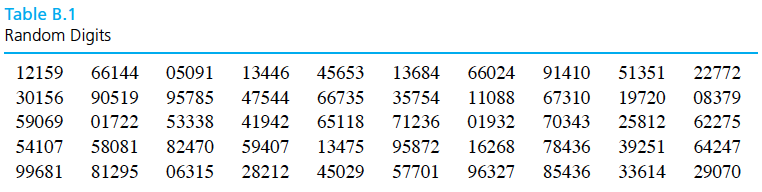

```{r setup, echo=FALSE, message=FALSE}
library(knitr)
library(tidyverse)
library(xtable)

knitr::opts_chunk$set(echo=FALSE, message=FALSE, warning=FALSE, fig.height = 2)
theme_set(theme_bw(base_family = "serif"))
```

\setcounter{section}{1}

# Data collection

Data collection is one of the most important parts of engineering statistics. If collected properly, data can make formal inferences easy to complete and easy to understand. On the other hand, if data is collected poorly, it can become nearly impossible to salvage a badly designed study and gain insights.

This chapter covers the general principles of data collection and effective experimentation. 

## Sampling

\begin{itemize}
\itemsep .1in
\item[Q:]The most common question engineers ask about data collection is
\item[A:]The answer depends on the variation in response that one expects.
\end{itemize}
\vspace{.1in}

Often we want to answer a question (conduct a study) about an identifyable, concrete population of items, but we want to use a **sample** to represent this (typically) much larger population.

**Why?**
\vspace{.75in}

\begin{ex}
Measuring some characteristics of a sample of 20 electrical components (note: this is one sample with 20 units; the sample size is 20) from an incoming lot of 200.
\end{ex}
\vspace{.1in}
If a sample is to be used to stand for a population, how that sample is chosen becomes very important. 

A sample should

\newpage


### Systematic and judgement based methods

\begin{df}
In \emph{systematic sampling}, create a list of every member of the population. From the list, randomly select the first sample element from the first $k$ elements on the population list. Thereafter, we select every $k^{th}$ element on the list. 
\end{df}
\vspace{.1in}

**Disadvantage:** 

\vspace{.5in}
\begin{df}
In \emph{judgement-based sampling}, select based on the opinion of an expert.
\end{df}
\vspace{.1in}

**Disadvantage:** 

\vspace{.1cm}

### Simple random sampling

\begin{df}
A \emph{simple random sample of size $n$} from a population is a sample selected in such a manner that every collection of $n$ items in the population is a priori equally likely to compose the sample.
\end{df}
\vspace{.5in}
\begin{ex}
A statistics instructor wanted to know how many hours per week her students spend watching cat videos on YouTube. Rather than asking each one of them, she puts all of their names in a hat and draws out 10. This is a simple random sample of size 10.
\end{ex}

\newpage

**Steps to randomly sample mechanically:**

1. Let $M$ be the number of digits in the number $N$, where $N$ is the population size.
2. Give each member of the population an $M$-digit label.
3. Move through the table of random digits from left to right, top to bottom, selecting population members for the sample when you encounter their indices (ignoring indices that have already been chosen) until you have selected $n$ units for the sample.

\vspace{.25in}

\vspace{.25in}

\begin{ex}
Take a simple random sample of $12$ units of pig iron out of a shipment of $90$ units.
\end{ex}
\vspace{1in}


**Alternatively:** Use a computer.

\newpage

## Taxonomy of variables