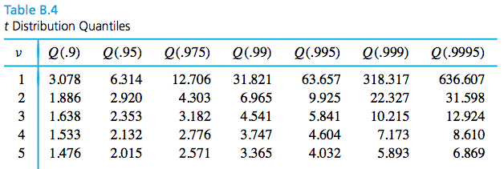

```{r setup, echo=FALSE, message=FALSE}
library(knitr)
library(tidyverse)
library(xtable)
library(MASS)

knitr::opts_chunk$set(echo=FALSE, message=FALSE, warning=FALSE, fig.height = 2)
theme_set(theme_bw(base_family = "serif"))

set.seed(305)
```

\setcounter{section}{5}

# Introduction to formal statistical inference

Formal statistical inference uses probability theory to quantify the reliability of data-based conclusions. We want information on a population. We can use:

\vspace{.75in}

1. Point estimates:

\vspace{1.5in}

2. Interval estimates:

\vspace{1.5in}

## Large-sample confidence intervals for a mean

Many important engineering applications of statistics fit the following mold. Values for parameters of a data-generating process are unknown. Based on data, the goal is

1.
2.

\newpage

\begin{df}
A \emph{confidence interval} for a parameter (or function of one or more parameters) is a data-based interval of numbers thought likely to contain the parameter (or function of one or more parameters) possessing a stated probability-based confidence or reliability.
\end{df}

A confidence interval is a realization of a **random interval**, an interval on the real line with a random variable at one or both of the endpoints.

\vspace{.2in}

\begin{ex}[Instrumental drift]
Let $Z$ be a measure of instrumental drift of a random voltmeter that comes out of a certain factory. Say $Z\sim N(0,1)$. Define a random interval:
$$
(Z-2,Z+ 2)
$$
What is the probability that $-1$ is inside the interval? 
\end{ex}

\newpage

\begin{ex}[More practice]
Calculate:

\begin{enumerate}
\item $P(2 \text{ in } (X-1,X+ 1))$, $X\sim N(2,4)$
\vfill
\item $P(6.6 \text{ in } (X-2,X+ 1))$, $X\sim N(7,2)$
\vfill
\end{enumerate}
\end{ex}

\newpage

\begin{ex}[Abstract random intervals]
Let's say $X_1,X_2,\dots,X_n$ are iid with $n\ge 25$, mean $\mu$, variance $\sigma^2$. We can find a random interval that provides a lower bound for $\mu$ with $1 - \alpha$ probability:

\newpage


Calculate:
\begin{enumerate}
\item $P(\mu \in (-\infty, \overline{X} + z_{1-\alpha}\frac{\sigma}{\sqrt{n}})), X \sim N(\mu,\sigma^2)$
\vfill
\item $P(\mu \in (\overline{X} - z_{1-\alpha/2}\frac{\sigma}{\sqrt{n}}, \overline{X} + z_{1-\alpha/2}\frac{\sigma}{\sqrt{n}})), X \sim N(\mu,\sigma^2)$
\vfill
\end{enumerate}
\end{ex}

\newpage


### A Large-$n$ confidence interval for $\mu$ involving $\sigma$

A **$1-\alpha$ confidence interval** for an unknown parameter is the realization of a random interval that contains that parameter with probability $1-\alpha$.

\vspace{.5in}

For random variables $X_1,X_2,\dots,X_n$ iid with E($X_1) = \mu$, Var($X_1) = \sigma^2$, a $1-\alpha$ confidence interval for $\mu$ is
$$
(\overline{x} - z_{1-\alpha/2}\frac{\sigma}{\sqrt{n}}, \overline{x} + z_{1-\alpha/2}\frac{\sigma}{\sqrt{n}})
$$
which is a **realization** from the random interval
$$
(\overline{X} - z_{1-\alpha/2}\frac{\sigma}{\sqrt{n}}, \overline{X} + z_{1-\alpha/2}\frac{\sigma}{\sqrt{n}}).
$$

\vspace{.2in}

\begin{itemize}
\itemsep 1in 
\item Two-sided $1-\alpha$ confidence interval for $\mu$
\item One-sided $1-\alpha$ confidence interval for $\mu$ with a upper confidence bound
\item One-sided $1-\alpha$ confidence interval for $\mu$ with a lower confidence bound
\end{itemize}

\newpage

\begin{ex}[Fill weight of jars]
Suppose a manufacturer fills jars of food using a stable filling process with a known standard deviation of $\sigma = 1.6$g. We take a sample of $n=47$ jars and measure the sample mean weight $\overline{x} = 138.2$g. A two-sided $90$\% confidence interval ($\alpha = 0.1$) for the true mean weight $\mu$ is:
\vfill
Interpretation:
\vspace{2in}
\newpage
What if we just want to be sure that the true mean fill weight is high enough?
\newpage
\end{ex}

\begin{ex}[Hard disk failures]
F. Willett, in the article "The Case of the Derailed Disk Drives?" (\emph{Mechanical Engineering}, 1988), discusses a study done to isolate the cause of link code A failure in a model of Winchester hard disk drive. For each disk, the investigator measured the breakaway torque (in. oz.) required to loosen the drive's interrupter flag on the stepper motor shaft. Breakaway torques for $26$ disk drives were recorded, with a sample mean of $11.5$ in. oz. Suppose you know the true standard deviation of the breakaway torques is $5.1$ in. oz. Calculate and interpret:
\begin{enumerate}
\item A two-sided $90$\% confidence interval for the true mean breakaway torque of the relevant type of Winchester drive.
\vfill
\item An analogous two-sided $95$\% confidence interval.
\vfill
\end{enumerate}

\end{ex}
\newpage
\begin{ex}[Width of a CI]
If you want to estimate the breakaway torque with a 2-sided, $95$\% confidence interval with $\pm 2.0$ in. oz. of precision, what sample size would you need?

\end{ex}

\newpage

### A generally applicable large-$n$ confidence interval for $\mu$

Although the equations for a $1-\alpha$ confidence interval is mathematically correct, it is severely limited in its usefulness because

\vspace{.5in}

If $n \ge 25$ and $\sigma$ is *unknown*, $Z = \frac{\overline{X} - \mu}{s/\sqrt{n}}$, where 
$$
s = \sqrt{\frac{1}{n-1}\sum\limits_{i = 1}^n (x_i-\overline{x})^2}.
$$
is still **approximately standard normally distributed**. So, you can replace $\sigma$ in the confidence interval formula with the sample standard deviation, $s$.

\begin{itemize}
\itemsep 1in 
\item Two-sided $1-\alpha$ confidence interval for $\mu$
\item One-sided $1-\alpha$ confidence interval for $\mu$ with a upper confidence bound
\item One-sided $1-\alpha$ confidence interval for $\mu$ with a lower confidence bound
\end{itemize}
\newpage

```{r}
wire <- c(100.37, 96.31, 72.57, 88.02, 105.89, 107.80, 75.84, 92.73, 67.47, 94.87, 122.04, 115.12, 95.24, 119.75, 114.83, 101.79, 80.90, 96.10, 118.51, 109.66, 88.07, 56.29, 86.50, 57.62, 74.7, 92.53, 86.25, 82.56, 97.96, 94.92, 62,93, 98.44, 119.37, 103.70, 72.40, 71.29, 107.24, 64.82, 93.51, 86.97)
```

\begin{ex}
Suppose you are a manufacturer of construction equipment. You make $0.0125$ inch wire rope and need to determine how much weight it can hold before breaking so that you can label it clearly. Here are breaking strengths, in kg, for $`r length(wire)`$ sample wires:
\end{ex}

```{r, comment=NA}
wire
```

The sample mean breaking strength is $`r round(mean(wire), 2)`$ kg and the sample standard deviation is $`r round(sd(wire), 2)`$ kg. Using the appropriate $95$% confidence interval, try to determine whether the breaking strengths meet the requirement of at least $85$ kg.

\newpage

## Small-sample confidence intervals for a mean

The most important practical limitation on the use of the methods of the previous sections is

\vspace{.5in}

That restriction comes from the fact that without it,

\vspace{1in}

So, if one mechanically uses the large-$n$ interval formula $\overline{x} \pm z \frac{s}{\sqrt{n}}$ with a small sample,

\vspace{1in}

**If** it is sensible to model the observations as iid normal random variables, then we can arrive at inference methods for small-$n$ sample means.


\newpage

### The Student $t$ distribution

\vspace{.2in}

\begin{df}
The \emph{(Student) $t$ distribution with degrees of freedom parameter $\nu$} is a continuous probability distribution with probability density
$$
f(t) = \frac{\Gamma\left(\frac{\nu + 1}{2}\right)}{\Gamma\left(\frac{\nu}{2}\right)\sqrt{\pi \nu}}\left(1 + \frac{t^2}{\nu}\right)^{-(\nu + 1)/2} \qquad \qquad \text{for all }t.
$$
\end{df}

The $t$ distribution
 
- is bell-shaped and symmetric about $0$
- has fatter tails than the normal, but approaches the shape of the normal as $\nu \rightarrow \infty$.

We use the $t$ table (Table B.4 in Vardeman and Jobe) to calculate quantiles. 

\vspace{.5in}

```{r, fig.height=4}
expand.grid(x = seq(-3, 3, length.out = 200),
            df = c(1, 2, 5, 11, 20)) %>%
  mutate(f = dt(x, df)) %>% 
  mutate(df = as.character(df)) %>%
  bind_rows(data.frame(x = seq(-3, 3, length.out = 200), df = "Standard normal") %>%
            mutate(f = dnorm(x))) %>%
  mutate(df = factor(df, levels = c("1", "2", "5", "11", "20", "Standard normal"))) %>%
  ggplot() +
  geom_line(aes(x, f, group = df, linetype = df, colour = df)) +
  xlab("t") + ylab("f(t)") + 
  scale_colour_discrete(expression(nu)) +
  scale_linetype_discrete(expression(nu))


```

\newpage

\begin{ex}[$t$ quantiles]
Say $T \sim t_5$. Find $c$ such that $P(T \le c) = 0.9$.
\end{ex}



\vspace{2in}

### Small-sample confidence intervals, $\sigma$ unknown

**If** we can assume that $X_1,\dots,X_n$ are iid with mean $\mu$ and variance $\sigma^2$, and are also normally distributed,

\vspace{2in}

We can then use $t_{n-1,1-\alpha/2}$ instead of $z_{1-\alpha/2}$ in the confidence intervals.

\vspace{2in}

\begin{itemize}
\itemsep 1in 
\item Two-sided $1-\alpha$ confidence interval for $\mu$
\item One-sided $1-\alpha$ confidence interval for $\mu$ with a upper confidence bound
\item One-sided $1-\alpha$ confidence interval for $\mu$ with a lower confidence bound
\end{itemize}

\newpage

\begin{ex}[Concrete beams]
10 concrete beams were each measured for flexural strength (MPa). Assuming the flexural strengths are iid normal, calculate and interpret a two-sided $99$\% CI for the flexural strength of the beams. 

```{r, comment = NA, results='asis'}
beams <- c(8.2, 8.7, 7.8, 9.7, 7.4, 7.8, 7.7, 11.6, 11.3, 11.8)
print(beams)
```

\vfill

Is the true mean flexural strength below the minimum requirement of 11 MPa?  Find out with the appropriate 95\% CI.

\vfill

\end{ex}
\newpage


\begin{ex}[Paint thickness]
Consider the following sample of observations on coating thickness for low-viscosity paint.
\end{ex}

```{r, comment=NA}
paint <- c(0.83, 0.88, 0.88, 1.04, 1.09, 1.12, 1.29, 1.31, 1.48, 1.49, 1.59, 1.62, 1.65, 1.71, 1.76, 1.83)
paint
```

A normal QQ plot shows that they are close enough to normally distributed.

```{r}
y <- quantile(paint[!is.na(paint)], c(0.25, 0.75))
x <- qnorm(c(0.25, 0.75))
slope <- diff(y)/diff(x)
int <- y[1L] - slope * x[1L]

d <- data.frame(resids = paint)

ggplot(d, aes(sample = resids)) + 
  stat_qq() + 
  geom_abline(slope = slope, intercept = int)


```

Calculate and interpret a two-sided $90$% confidence interval for the true mean thickness.

\newpage

\includepdf[pages=-]{../../tables/t.pdf}
